<h1 align="center">FuseEdge Design System</h1>

## Overview

This design system includes a Grid System, Colors, Typography, Icons, Buttons,
Cards, and Navigation - all designed with Figma!

## Figma File

### Design-System:

[View in Figma](https://www.figma.com/design/3RVRsS95wbyeNSEIeJLcJa/FuseEdge-Design-System?node-id=0-1&t=qNj0i1ophb51j519-1)

### Mid-Fidelity & High-Fidelity Designs:

[View in Figma](https://www.figma.com/design/h75T5cu8cTDYLRSLKy1fri/Mid-Fidelity---High-Fidelity-Designs?node-id=55-130&t=0iNxa6a5DiTfJSPc-1)

## Previews:

## Process:

- What was the brief or goal?
  My main goal was to make designs that the user was familiar with. Since our
  application was utilizing Azure OAuth, I wanted to create a 'Microsoft Experience'
  with colors, designs, ratios, etc.

- What research or exploration did you do?
  We explored similar designs in the same space as ours (Monday, Clickup, etc)
  and decided simplified assets and Typography made the most sense for our Design-System

- What decisions did you make and why?
  We deliberately decided to go with simplified colors that highlight important
  areas, highlight success or error messages, structure clean charts or
  dashboards, and easy to read buttons and cards.

## Tools & Techniques

- Figma
- <!-- e.g. Auto Layout, Variables, Variants, Prototyping -->

## Status

Complete
